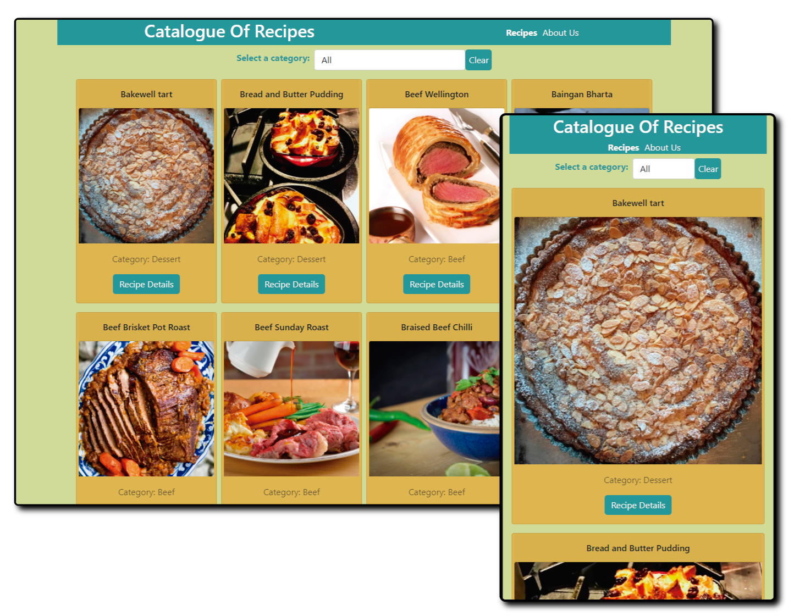
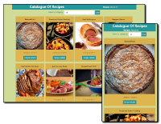

[![Contributors][contributors-shield]][contributors-url]
[![Forks][forks-shield]][forks-url]
[![Stargazers][stars-shield]][stars-url]
[![Issues][issues-shield]][issues-url]


# Catalogue with React and Redux


<!-- TABLE OF CONTENTS -->
## Table Of Contents

* [About The Project](#about-the-project)
* [Preview](#preview)
* [Live Demo](#live-demo)
* [Video Presentation](#video-presentation)
* [Built With](#built-with)
* [Getting Started](#getting-started)
* [Author](#author)
* [Acknowledgements](#acknowledgements)
* [License](#license)

<!-- ABOUT THE PROJECT -->
## About The Project

This project is a catalogue of recipes. It's a SPA that lists filterable food items. 
It's built with React and Redux.
The data on the API are obtained, stored on Redux store, and then displayed on the browser through async fetch request. I also used Redux hooks to manage state data.
Inner pages are implemented using React's Router.
The API data is fetched from The Meal DB [themealdb API](https://www.themealdb.com/api.php).
The details of individual food items are displayed on the show page.

## Preview


## Live Demo
It's deployed [HERE](https://mv-recipex-catalogue.herokuapp.com/) on heroku

## Video Presentation
[](https://www.youtube.com/watch?v=)

### Built With
This project was built using these technologies.
* React
* Redux
* JS6
* [themealdb API](https://www.themealdb.com/api.php)
* Axios
* React-DOM
* Bootstrap
* PropTypes
* Redux-thunk
* ES6
* Jest
* Enzyme
* CSS modules
* React Testing Library


### Getting Started

To get a local copy up and running follow these simple example steps.

### Prerequisites

 * [Node.js](https://nodejs.org/) is required to install dependencies and run scripts via npm.
 * A modern browser

### Clone
* Clone this repo:
  - Clone with SSH:
  ```
    git@github.com:maosan132/Recipe-finder-with-react-redux
  ```
  - Clone with HTTPS
  ```
    https://github.com/maosan132/Recipe-finder-with-react-redux/
  ```
  - Clone with GitHub CLI
  ```
    gh repo clone maosan132/Recipe-finder-with-react-redux

 - cd to Recipes

### Setup
To install dependencies:

Run ```$ npm install```

To start the local webserver and have the application run live on http://localhost:3000/:

Run ```$ npm start```

To run tests:

Run ```$ npm run test``` or simply ```$ npm test```


<!-- CONTACT -->
## Author

👤 **Mauricio Santos**

- Github: [@maosan132](https://github.com/maosan132)
- Twitter: [@maosan132](https://twitter.com/maosan132)
- Linkedin: [maurisantos](https://www.linkedin.com/in/mauricsantos)

## 🤝 Contributing

Contributions, issues and feature requests are welcome!

Feel free to check the [issues page](maosan132/Recipe-finder-with-react-redux/issues).

## Show your support

Give a :star: if you like this project!


<!-- ACKNOWLEDGEMENTS -->
## Acknowledgements
* [Microverse](https://www.microverse.org/) - Microverse website

<!-- MARKDOWN LINKS & IMAGES -->
<!-- https://www.markdownguide.org/basic-syntax/#reference-style-links -->
[contributors-shield]: https://img.shields.io/github/contributors/jamezjaz/Platform_Game.svg?style=flat-square
[contributors-url]: https://github.com/jamezjaz/Platform_Game/graphs/contributors
[forks-shield]: https://img.shields.io/github/forks/jamezjaz/Platform_Game.svg?style=flat-square
[forks-url]: https://github.com/jamezjaz/Platform_Game/network/members
[stars-shield]: https://img.shields.io/github/stars/jamezjaz/Platform_Game.svg?style=flat-square
[stars-url]: https://github.com/jamezjaz/Platform_Game/stargazers
[issues-shield]: https://img.shields.io/github/issues/jamezjaz/Platform_Game.svg?style=flat-square
[issues-url]: https://github.com/jamezjaz/Platform_Game/issues

## 📝 License

This project is [MIT](https://opensource.org/licenses/MIT) licensed.
